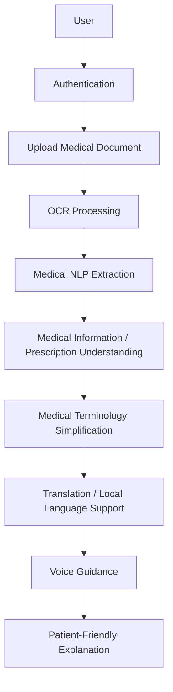

# AI-Powered Healthcare Communication Assistant for Rural Communities

A healthcare communication assistant that helps patients understand medical documents and health instructions through OCR, medical NLP extraction, simplified explanations, translation support, authentication, and voice guidance.

This README is written from the perspective of my implementation work in this repository. It focuses on the modules I contributed to or integrated: healthcare OCR, OCR-to-NLP processing, authentication and authorization, voice guidance using gTTS, and the patient-facing workflow that connects these pieces.

## Overview

Patients in rural and underserved communities often face practical barriers when reading medical documents:

- Prescriptions and reports contain medical jargon and abbreviations.
- Handwritten or scanned documents can be difficult to read.
- Medicine dosage, frequency, route, and duration may not be obvious.
- English-only instructions can create language barriers.
- Patients may need audio guidance instead of text-only explanations.

This project addresses those problems through a pipeline that accepts uploaded medical documents, extracts text using OCR, identifies useful medical entities, simplifies the information, supports translation, and provides text-to-speech voice guidance for patient-friendly explanations.

## My Implementation

My primary contribution focuses on these areas:

- Healthcare OCR for medical documents, including image/PDF handling and OCR evaluation workflows.
- OCR-to-NLP integration so extracted text can flow into medical entity extraction.
- Medical NLP extraction for medicines, dosage, frequency, route, duration, patient details, diagnoses, symptoms, and lab tests where available.
- Authentication and authorization integration using JWT access and refresh tokens.
- Voice Guidance using gTTS and frontend playback controls.
- End-to-end healthcare communication flow from upload to patient-friendly explanation.

I do not claim ownership of unrelated team modules or unsupported integrations. Features such as Pinecone RAG, BGE-M3 embeddings, Ollama reasoning, and Whisper STT exist in parts of the repository, but this README does not present them as my main implementation contribution.

## Key Features

### 1. Secure Authentication

The backend includes JWT-based authentication routes for:

- User registration.
- JSON login for the frontend.
- OAuth2 password login for Swagger/API clients.
- Access token and refresh token issuing.
- Token refresh.
- Logout using token blocklisting.
- Password change for authenticated users.
- Current user profile retrieval.
- Preferred language update.

The frontend includes authentication state handling, protected routing, login/register screens, logout integration, and profile state updates. The repository also contains forgot/reset password UI pages, but a complete backend forgot-password/reset-token workflow was not verified in the current source.

### 2. Medical Document OCR

The repository contains OCR processing for healthcare documents such as prescriptions, lab reports, discharge summaries, certificates, medicine labels, and similar uploaded records.

Verified OCR behavior includes:

- Upload validation for images and PDFs.
- Supported backend file extensions in the medical-history OCR settings: `.jpg`, `.jpeg`, `.png`, `.pdf`.
- PDF text extraction with PyMuPDF where possible.
- PDF-to-image rendering for scanned PDFs where required.
- Image decoding and preprocessing with OpenCV/Numpy.
- PaddleOCR integration when `paddleocr` is installed.
- Defensive fallback behavior when the OCR engine is unavailable or no text is detected.
- OCR confidence, per-page output, merged text, and persisted JSON output for audit/reprocessing.

The frontend upload flow also includes client-side OCR support through Tesseract.js for browser-side extraction and preview behavior.

### 3. Medical NLP Extraction

OCR output is passed into a medical NLP pipeline that extracts structured information from text.

Verified extracted fields include:

- Medicine names.
- Dosage or strength, such as `500mg`.
- Frequency, such as `OD`, `BD`, `TDS`, `1-0-1`.
- Human-readable frequency where mapped.
- Duration.
- Route, such as oral, IV, topical, inhalation, and related variants.
- Form, such as tablet, capsule, injection, syrup, drops, cream, and inhaler.
- Patient name, age, and gender where available.
- Doctor and hospital/clinic names where available.
- Diagnoses, diseases, symptoms, dates, and lab tests where detected.

BioClinicalBERT is configured through `emilyalsentzer/Bio_ClinicalBERT` and is used when the Transformers model loads successfully. The code also includes regex and keyword-based fallback extraction so the pipeline can still produce structured output when the model is unavailable.

### 4. Medical Report / Prescription Understanding

The report pipeline connects OCR and NLP results into stored medical-report records. It builds structured report data including OCR text, confidence, patient/doctor/hospital metadata, extracted entities, primary medication, processing status, and timing information.

The medical-history backend also keeps uploaded records in an in-memory store for the local development flow and exposes list/detail/delete endpoints for those records.

### 5. Simplification and Translation

The core healthcare backend includes simplification and translation APIs.

Verified behavior includes:

- Simplifying raw text or a stored report.
- Translating raw text or a stored report simplification.
- Translation term protection for dosages, units, dates, numbers, medicine names, and supplied protected terms.
- Dictionary/phrase-based translation support for the verified language codes: `en`, `ta`, `kn`, `te`, `hi`.
- Cached database rows for stored report translations.

The translation implementation is intentionally conservative: phrases that are not covered by the phrase bank may remain in English instead of being guessed.

### 6. Voice Guidance

The project includes a Voice Guidance feature for spoken patient-facing explanations.

Verified behavior includes:

- gTTS-based text-to-speech generation.
- Language-aware TTS using a frontend-selected language and backend language map.
- `POST /api/tts` endpoint returning `audio/mpeg`.
- Frontend voice playback controls in the assistant screen.
- Loading/playing/stop behavior through frontend audio state.
- Graceful frontend error handling when TTS playback or generation fails.

The current source does not show a persistent MD5-based TTS audio cache. If that was implemented in another branch, it is not present in the current checked-out code and is therefore listed as future work rather than a completed feature.

### 7. Patient Dashboard / Healthcare UI

The frontend includes a patient-facing healthcare UI with:

- Home/dashboard views.
- Upload and OCR screens.
- Medical history views.
- Profile page.
- Assistant page with text, voice input, and TTS playback.
- Bottom navigation and navbar layouts.
- Dashboard statistics loaded from the real backend endpoint `/api/prescriptions/stats`.

Dashboard statistics depend on backend availability and real uploaded records. If there are no records, zero values are valid.

## End-to-End Workflow



## System Architecture

The repository is organized as a React frontend with multiple FastAPI backend modules used during development.

| Area | What Exists in the Repository |
|---|---|
| Frontend | React 18 + Vite app under `src/`, with pages for auth, home, upload, history, profile, dashboard, results, and assistant. |
| Master API | `server1.py` mounts selected dashboard, medical-history/profile, and auth routers and exposes assistant, OCR, transcription, and TTS routes. |
| Healthcare backend | `healthcare-backend/backend/app/` contains auth, OCR/report, simplification, translation, dashboard, profile, and medical-history APIs. |
| Medical history backend | `medicalHistory_and_Profile_backend/medical_history_backend/` contains OCR, NLP, prescription, profile, and medical-history logic. |
| OCR service | PaddleOCR wrapper with PDF/image handling and preprocessing, plus fallback behavior when PaddleOCR is not installed. |
| NLP service | BioClinicalBERT configuration plus regex/keyword extraction for medical entities. |
| Authentication | JWT access/refresh token service, password hashing, logout token blocklist, protected route dependencies. |
| Voice/TTS | gTTS generation in `voice_helpers.py`, exposed through `POST /api/tts` in `server1.py`. |
| Database | SQLite/SQLAlchemy in the core backend; in-memory record storage in the medical-history backend development flow. |

## OCR Pipeline

The medical-history OCR flow is implemented around `PipelineService`:

1. Accept an uploaded file.
2. Validate extension, MIME type, and size.
3. Read image/PDF bytes.
4. Extract text directly from text-based PDFs where possible.
5. Convert scanned PDFs to images where required.
6. Preprocess images using resize, optional denoise, and deskew logic.
7. Run PaddleOCR when available.
8. Reconstruct line order and confidence scores.
9. Merge and clean OCR text.
10. Pass cleaned OCR text into NLP extraction.
11. Persist structured JSON output under the configured output directory.

Example response shape from `POST /api/medical-history/upload`:

```json
{
  "success": true,
  "message": "Prescription processed and saved successfully.",
  "data": {
    "id": "record-id",
    "filename": "prescription.pdf",
    "fileType": "pdf",
    "originalOCRText": "extracted OCR text",
    "ocrConfidence": 0.91,
    "medicines": [],
    "diagnosis": [],
    "status": ["Processed"],
    "processingStatus": "completed",
    "createdAt": "2026-08-09T00:00:00Z"
  }
}
```

## Medical NLP Pipeline

The NLP layer receives cleaned OCR text and extracts structured entities. It uses BioClinicalBERT when the model loads successfully and supplements it with deterministic fallback extraction.

Main extraction methods include:

- Regex patterns for dosage, duration, dates, age, gender, patient name, doctor name, hospital, and lab tests.
- Keyword banks for common medicines, symptoms, and diseases.
- Frequency mapping for prescription shorthand such as `OD`, `BD`, `TDS`, `HS`, `SOS`, `1-0-1`, and related forms.
- Route mapping for oral, injection, IV, IM, topical, inhalation, nasal, eye-drop, and ear-drop instructions.
- Confidence and review flags when OCR quality is low or model extraction is incomplete.

## Authentication

The main auth router is defined with prefix `/auth` and is mounted by `server1.py` under both `/api` and `/api/v1`. The same routes are therefore available as `/api/auth/...` and `/api/v1/auth/...` when using the master server.

| Method | Endpoint | Purpose |
|---|---|---|
| `POST` | `/api/auth/register` | Register a user account. |
| `POST` | `/api/auth/login-json` | Frontend JSON login with email and password. |
| `POST` | `/api/auth/login` | OAuth2 password login for Swagger/API clients. |
| `POST` | `/api/auth/refresh` | Refresh access and refresh tokens. |
| `POST` | `/api/auth/logout` | Revoke the current access token through token blocklisting. |
| `POST` | `/api/auth/change-password` | Change password for the authenticated user. |
| `GET` | `/api/auth/profile` | Return the authenticated user profile. |
| `PUT` | `/api/auth/profile/language` | Update preferred language. |

Security mechanisms verified in source:

- JWT access tokens.
- JWT refresh tokens.
- Password hashing through Passlib/Bcrypt.
- Token `jti` blocklisting for logout.
- Protected dependencies for authenticated API access.
- Frontend auth token storage and protected route handling.

## Voice Guidance

The voice guidance implementation is centered on `voice_helpers.py` and `server1.py`.

| Method | Endpoint | Purpose |
|---|---|---|
| `POST` | `/api/tts` | Convert text and language into an MP3 audio stream using gTTS. |
| `POST` | `/api/transcribe` | Transcribe uploaded audio using Groq Whisper when configured, with local Whisper fallback. |

TTS request example:

```json
{
  "text": "Take this medicine twice a day after food.",
  "language": "English"
}
```

The frontend calls `/api/tts`, converts the returned audio blob into an object URL, and plays it using the browser `Audio` API. Playback state is tracked so the UI can show listen/stop behavior.

## Technology Stack

| Layer | Technology | Purpose |
|---|---|---|
| Frontend | React 18, Vite 5 | Web application and page routing. |
| Styling/UI | Tailwind CSS, Radix UI, Lucide React | Responsive healthcare UI and reusable components. |
| Frontend OCR | Tesseract.js, pdfjs-dist | Browser-side OCR and PDF handling in upload flow. |
| Backend | FastAPI, Uvicorn, Pydantic | REST APIs for auth, OCR, reports, translation, dashboard, and voice. |
| OCR | PaddleOCR, PyMuPDF, OpenCV, Pillow | Medical document text extraction and preprocessing. |
| NLP | Transformers, BioClinicalBERT, regex extraction | Medical entity extraction from OCR text. |
| Authentication | Python-Jose, Passlib, Bcrypt | JWT tokens, refresh tokens, and password hashing. |
| Database | SQLite, SQLAlchemy, aiosqlite | Local relational storage for core backend modules. |
| Translation | Phrase-dictionary translation service | Conservative local-language support with protected medical terms. |
| TTS | gTTS | Spoken audio generation for patient guidance. |
| Assistant/STT | Groq, OpenAI Whisper | Voice transcription where configured. Not claimed as my primary contribution. |
| Optional RAG tooling | Pinecone, ChromaDB, sentence-transformers, Ollama | Present in repository tooling and assistant flow, but not claimed here as my implementation focus. |
| Testing | pytest, pytest-asyncio | Backend and integration test support. |

## Project Structure

```text
.
+-- README.md
+-- package.json
+-- requirements.txt
+-- vite.config.js
+-- server1.py
+-- voice_helpers.py
+-- query_rag.py
+-- test_bge.py
+-- src/
¦   +-- App.jsx
¦   +-- main.jsx
¦   +-- components/
¦   ¦   +-- auth/
¦   ¦   +-- dashboard/
¦   ¦   +-- healthcare/
¦   ¦   +-- layout/
¦   ¦   +-- ui/
¦   +-- contexts/
¦   +-- pages/
¦   ¦   +-- assistant/
¦   ¦   +-- auth/
¦   ¦   +-- dashboard/
¦   ¦   +-- history/
¦   ¦   +-- home/
¦   ¦   +-- profile/
¦   ¦   +-- results/
¦   ¦   +-- upload/
¦   +-- services/
+-- healthcare-backend/
¦   +-- backend/
¦       +-- app/
¦       ¦   +-- api/v1/
¦       ¦   +-- core/
¦       ¦   +-- database/
¦       ¦   +-- models/
¦       ¦   +-- schemas/
¦       ¦   +-- services/
¦       +-- requirements.txt
¦       +-- tests/
+-- medicalHistory_and_Profile_backend/
¦   +-- medical_history_backend/
¦       +-- app/
¦       ¦   +-- config/
¦       ¦   +-- controllers/
¦       ¦   +-- routers/
¦       ¦   +-- schemas/
¦       ¦   +-- services/
¦       ¦   +-- utils/
¦       +-- outputs/
¦       +-- requirements.txt
¦       +-- test_e2e.py
¦       +-- test_upload_only.py
+-- Dashboard_Backend_API/
    +-- main.py
    +-- requirements.txt
    +-- app/
        +-- database/
        +-- models/
        +-- routes/
```

## Installation

These instructions are for Windows development with PowerShell.

### 1. Clone and enter the project

```powershell
git clone <repository-url>
cd AI-Powered-Healthcare-Communication-Assistant-for-Rural-Communities_Jun_2026
```

### 2. Create and activate a Python virtual environment

Python 3.10 or 3.11 is recommended for the dependency set used by the project.

```powershell
python -m venv .venv
.\.venv\Scripts\Activate.ps1
python -m pip install --upgrade pip
pip install -r requirements.txt
```

If you are working only on a backend submodule, install its local requirements instead or in addition:

```powershell
pip install -r healthcare-backend\backend\requirements.txt
pip install -r medicalHistory_and_Profile_backend\medical_history_backend\requirements.txt
```

### 3. Configure environment variables

Copy the example environment file and fill in only the services you plan to use:

```powershell
Copy-Item .env.example .env
```

Important values include:

```env
PORT=8000
FRONTEND_URL=http://localhost:5173
DATABASE_URL=sqlite:///./health_explained.db
SECRET_KEY=replace_with_a_strong_secret
REFRESH_SECRET_KEY=replace_with_a_strong_refresh_secret
OCR_LANGUAGE=en
OCR_USE_GPU=False
NLP_MODEL_NAME=emilyalsentzer/Bio_ClinicalBERT
GROQ_API_KEY=optional_for_voice_transcription
PINECONE_API_KEY=optional_for_rag_tooling
OLLAMA_MODEL=optional_for_assistant_tooling
```

PaddleOCR dependencies are listed as optional in the root `requirements.txt`. Install PaddleOCR/PaddlePaddle separately if you want the PaddleOCR engine active in your local environment.

### 4. Install frontend dependencies

```powershell
npm install
```

## Running the Project

### Start the master backend

```powershell
python server1.py
```

The master backend runs on:

```text
http://localhost:8000
```

Swagger documentation is available at:

```text
http://localhost:8000/docs
```

### Start the frontend

```powershell
npm run dev
```

The Vite development server is configured for:

```text
http://localhost:5173
```

The Vite config proxies `/api` requests to `http://localhost:8000`.

### Optional sub-backend startup

The repository also contains backend submodules that can be run independently for focused development:

```powershell
cd medicalHistory_and_Profile_backend\medical_history_backend
python -m uvicorn app.main:app --reload --port 8000
```

```powershell
cd healthcare-backend\backend
python -m uvicorn app.main:app --reload --port 8000
```

Use only one service on port `8000` at a time.

## API Documentation

### Master API (`server1.py`)

| Method | Endpoint | Purpose |
|---|---|---|
| `GET` | `/` | Service status and endpoint list. |
| `GET` | `/api/status` | Assistant/vector status. |
| `POST` | `/api/chat` | Assistant chat endpoint. |
| `POST` | `/api/transcribe` | Audio transcription endpoint. |
| `POST` | `/api/tts` | gTTS audio generation endpoint. |
| `POST` | `/api/ocr` | Unified OCR upload endpoint. |
| `POST` | `/api/ocr/upload` | Alias for unified OCR upload. |
| `POST` | `/api/medical-history/upload` | Unified upload alias in the master server. |

### Authentication

| Method | Endpoint | Purpose |
|---|---|---|
| `POST` | `/api/auth/register` | Register. |
| `POST` | `/api/auth/login-json` | JSON login. |
| `POST` | `/api/auth/login` | OAuth2 password login. |
| `POST` | `/api/auth/refresh` | Refresh tokens. |
| `POST` | `/api/auth/logout` | Logout/token blocklist. |
| `POST` | `/api/auth/change-password` | Change password. |
| `GET` | `/api/auth/profile` | Get current user profile. |
| `PUT` | `/api/auth/profile/language` | Update preferred language. |

### OCR and Medical Reports (`healthcare-backend/backend/app/api/v1`)

These routes are mounted under the configured API prefix in the core backend, and under `/api/v1` when routed through the master server where applicable.

| Method | Endpoint | Purpose |
|---|---|---|
| `POST` | `/api/v1/ocr/extract` | Authenticated OCR upload; runs OCR to NLP to simplify/translate to DB. |
| `GET` | `/api/v1/ocr` | List authenticated user's reports. |
| `GET` | `/api/v1/ocr/{report_id}` | Get a stored report. |
| `DELETE` | `/api/v1/ocr/{report_id}` | Delete a stored report. |
| `GET` | `/api/v1/ocr/{report_id}/simplified` | Get simplified report text. |
| `POST` | `/api/v1/ocr/{report_id}/translate` | Translate a stored report. |

### Medical History and Prescriptions

| Method | Endpoint | Purpose |
|---|---|---|
| `POST` | `/api/medical-history/upload` | Upload and process a medical document. |
| `GET` | `/api/medical-history` | List medical-history records. |
| `GET` | `/api/medical-history/{id}` | Get a medical-history record. |
| `DELETE` | `/api/medical-history/{id}` | Delete a medical-history record. |
| `GET` | `/api/prescriptions` | List prescription records. |
| `GET` | `/api/prescriptions/stats` | Dashboard statistics from real stored records. |
| `GET` | `/api/prescriptions/{id}` | Get a prescription record. |
| `POST` | `/api/prescriptions` | Create a prescription record. |
| `DELETE` | `/api/prescriptions/{id}` | Delete a prescription record. |

### Simplification and Translation

| Method | Endpoint | Purpose |
|---|---|---|
| `POST` | `/api/v1/simplify` | Simplify raw text or a stored report. |
| `POST` | `/api/v1/translate` | Translate raw text or a stored report simplification. |
| `GET` | `/api/v1/languages` | List supported language codes. |

### Dashboard and Profile

| Method | Endpoint | Purpose |
|---|---|---|
| `GET` | `/api/v1/dashboard` | Authenticated dashboard overview. |
| `GET` | `/api/v1/dashboard/notifications` | List notifications. |
| `PUT` | `/api/v1/dashboard/notifications/{notification_id}/read` | Mark notification as read. |
| `GET` | `/api/profile` | Get profile in medical-history/profile backend. |
| `PUT` | `/api/profile` | Update profile in medical-history/profile backend. |
| `GET` | `/api/profile/medical-history` | Get profile medical history. |
| `PUT` | `/api/profile/medical-history` | Update profile medical history. |

## Testing

Verified test/script files in the repository:

| File | Purpose |
|---|---|
| `medicalHistory_and_Profile_backend/medical_history_backend/test_e2e.py` | End-to-end medical-history/OCR backend test script. |
| `medicalHistory_and_Profile_backend/medical_history_backend/test_upload_only.py` | Upload-focused backend test script. |
| `healthcare-backend/backend/tests/test_translation.py` | Translation service tests. |
| `test_bge.py` | BGE/PDF indexing or RAG-related utility script; present in repository but not claimed as my main contribution. |

Typical commands:

```powershell
pytest healthcare-backend\backend\tests
python medicalHistory_and_Profile_backend\medical_history_backend\test_e2e.py
python medicalHistory_and_Profile_backend\medical_history_backend\test_upload_only.py
npm run build
```

I did not run these commands while rewriting this README.

## Security

Security mechanisms present in the source include:

- JWT access tokens and refresh tokens.
- Password hashing through Passlib/Bcrypt.
- Token `jti` values and blocklist table for logout revocation.
- Protected API dependencies for authenticated routes.
- Frontend authentication state and route protection.
- Upload validation for file extension, MIME type, and file size.
- Error responses for invalid files, missing records, unauthorized access, and failed processing.

This is a development project and should be reviewed before production use, especially around secrets, CORS policy, token storage, audit logging, and persistent file storage.

## Error Handling

The codebase includes error handling for:

- Invalid upload files and unsupported formats.
- OCR engine import or inference failures.
- Empty/no-text OCR results.
- Low OCR confidence and manual-review flags.
- NLP model load failure with fallback extraction.
- Authentication failures and invalid/expired tokens.
- Translation requests with unsupported target language codes.
- TTS generation failures surfaced as API errors and frontend playback fallback.
- Missing medical-history or prescription records.

## Current Limitations

- PaddleOCR is optional in the root requirements file; it must be installed separately for full PaddleOCR inference.
- Some flows use in-memory medical-history storage in development, so records may not persist across server restarts in that backend path.
- BioClinicalBERT loading depends on the local environment and model availability; fallback extraction is used when it is unavailable.
- Translation is phrase-dictionary based and conservative, not a full neural machine translation engine.
- The current checked-out code does not show a persistent MD5-based TTS cache.
- gTTS depends on network availability because it uses Google Text-to-Speech.
- Dashboard statistics depend on backend availability and actual uploaded records.
- Forgot/reset password UI exists, but a complete backend reset-token workflow was not verified.
- Assistant RAG/STT tooling is present in the repository, but it is not documented here as my implementation ownership.
- This README does not claim production deployment, SMS, WhatsApp, Telegram, push notifications, or GPU acceleration as completed features.

## Future Improvements

Future work that would improve the project:

- Add persistent MD5-based TTS caching using text and language as the cache key.
- Add offline or local TTS support for low-connectivity deployments.
- Fine-tune medical NER for prescription-specific entity labels.
- Add durable database-backed storage for every medical-history flow.
- Implement a verified forgot-password/reset-token backend workflow.
- Improve multilingual translation with a medical-safe MT backend.
- Add medication scheduling and reminders.
- Add push notifications after notification logic is fully implemented.
- Improve OCR evaluation reports and dataset-level metrics.
- Package the app for offline rural clinic deployment.

## My Contribution Summary

### My Contribution

- Healthcare OCR implementation and evaluation for medical documents.
- Image/PDF OCR processing workflow integration.
- OCR output preservation for downstream processing.
- OCR-to-NLP pipeline integration.
- Medical entity and prescription information extraction.
- Medicine, dosage, frequency, route, duration, and patient-detail extraction where available.
- BioClinicalBERT integration where applicable, with fallback extraction logic.
- Authentication and authorization implementation/integration.
- JWT-based session management with access and refresh tokens.
- Logout and protected API access integration.
- Voice Guidance using gTTS.
- Frontend TTS playback integration and error-state handling.
- API and end-to-end workflow testing support for OCR/auth/voice-related flows.

## License

No license file was verified in the current repository root during this rewrite. Add a `LICENSE` file before publishing if the project should be distributed under a specific license.
